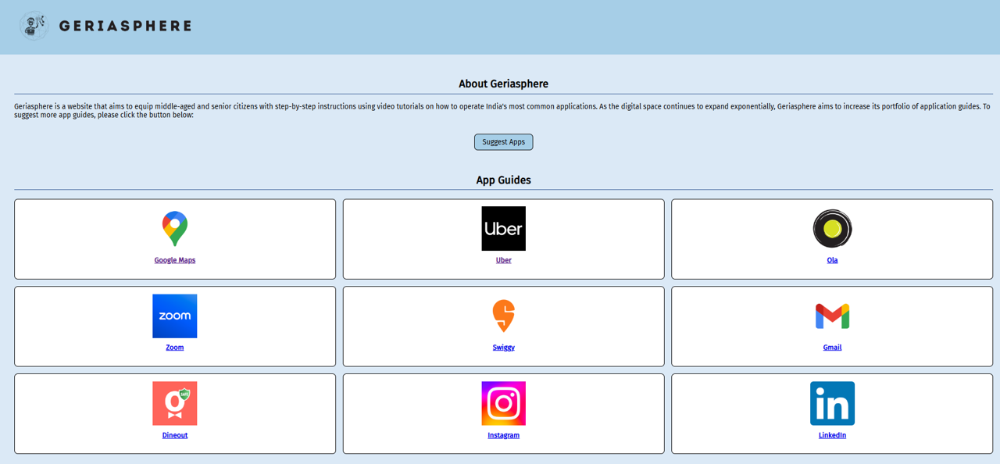
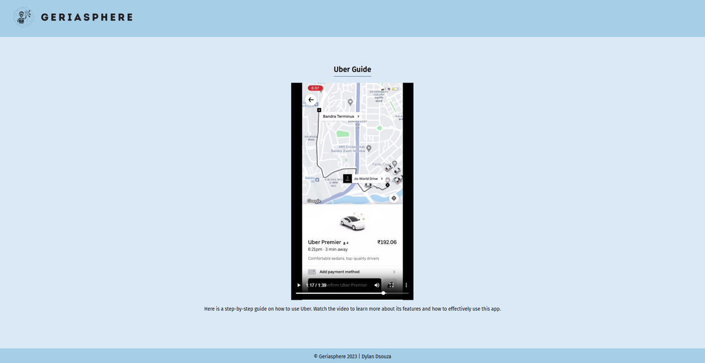

#🌐 Geriasphere: Technologically Empowering the Elderly

A comprehensive web platform designed to empower middle-aged and senior citizens with step-by-step video tutorials for India's most commonly used mobile applications and digital services.


**[Try Geriasphere Live](http://dsouza-dylan.github.io/geriasphere)**

## 🌐 What is Geriasphere?

As India rapidly embraces digitalization, millions of senior citizens find themselves struggling to navigate the digital landscape. Geriasphere addresses this critical gap by providing **clear, step-by-step video tutorials** specifically designed for middle-aged and senior citizens to master essential mobile applications.

The mission is to:
- **Democratize digital literacy** among India's aging population
- **Reduce technology anxiety** through patient, clear instruction
- **Enable independent digital navigation** for essential services

## ✨ Features

### 📱 Comprehensive App Tutorials
- **Transportation**: Uber, Ola ride-booking services
- **Navigation**: Google Maps location and directions
- **Communication**: Gmail email management, Zoom video calling
- **Social Media**: Instagram photo sharing, LinkedIn professional networking
- **Food Services**: Swiggy food delivery, Dineout restaurant reservations

### 🎥 Video-First Learning Approach
- **Step-by-step Visual Guides**: Easy-to-follow video demonstrations
- **Senior-Friendly Pacing**: Slower, deliberate instruction tempo
- **Clear Audio Narration**: Simple language explanations
- **Repetitive Key Actions**: Emphasis on important steps

### 🔄 Community-Driven Content
- **Suggestion System**: Integrated Google Forms for app requests
- **Responsive Design**: Accessible across devices and screen sizes
- **Intuitive Navigation**: Large buttons and clear visual hierarchy
- **Regular Updates**: Expanding library of application guides

### 🎯 Accessibility-First Design
- **Large, Clear Typography**: Easy reading for aging eyes
- **High Contrast Colors**: Improved visibility and readability
- **Simple Navigation**: Minimal clicks to reach content
- **Mobile-Responsive**: Works seamlessly on smartphones and tablets

## 🚀 Quick Start

### Local Development

1. **Clone the repository:**
```bash
git clone https://github.com/dsouza-dylan/geriasphere.git
cd geriasphere
```

2. **Open the project:**
```bash
# Simply open index.html in your web browser
# Or use a local server for development
python -m http.server 8000
# Navigate to http://localhost:8000
```

3. **Development setup** (optional):
```bash
# If using Live Server extension in VS Code
# Right-click index.html -> "Open with Live Server"
```

## 📁 Project Structure

```
Geriasphere/
├── index.html           
├── styles.css              
├── assets/                 
│   ├── logos/          
│   │   ├── [Geriasphere logo]
│   │   └── [app logos]
│   └── videos/            
│       └── [app tutorial videos]
    └── screenshots/
        └── [website screenshots]  
├── pages/                 
│   └── [app tutorial pages]
├── LICENSE
└── README.md
```

## 📱 Available App Guides

### 🚗 Transportation & Navigation
| App | Description | Status |
|-----|-------------|---------|
| **Uber** | Book rides, track drivers, payment methods | ✅ Available |
| **Ola** | Local ride-booking, fare estimation | ✅ Available |
| **Google Maps** | Navigation, location search, directions | ✅ Available |

### 💬 Communication & Social
| App | Description | Status |
|-----|-------------|---------|
| **Gmail** | Email management, sending/receiving | ✅ Available |
| **Zoom** | Video calling, meeting participation | ✅ Available |
| **Instagram** | Photo sharing, following friends | ✅ Available |
| **LinkedIn** | Professional networking, job search | ✅ Available |

### 🍽️ Food & Dining
| App | Description | Status |
|-----|-------------|---------|
| **Swiggy** | Food delivery, restaurant browsing | ✅ Available |
| **Dineout** | Restaurant reservations, deals | ✅ Available |

## 🎯 Target Audience

### Primary Users
- **Age Group**: 45-75+ years
- **Tech Experience**: Beginner to intermediate
- **Geographic Focus**: India
- **Device Preference**: Smartphones, tablets

## 🛠️ Technical Stack

### Frontend Technologies
- **HTML5**: Semantic markup and structure
- **CSS3**: Responsive design and animations

### Integration & Services
- **Google Forms**: Community feedback and suggestions
- **Video Hosting**: Local MP4 files for reliable playback
- **Responsive Design**: CSS Grid and Flexbox

## 📸 Screenshots

### Home Page


### Example App Tutorial (Uber)


## 📝 License

This project is licensed under the MIT License - see the [LICENSE](LICENSE) file for details.

## 🙏 Acknowledgments

- **Senior Citizens** for valuable feedback during an in-person workshop
- **Locality Members** who helped test and refine tutorials

## 📞 Contact

**Dylan Dsouza** - *Creator*

- Email: [dydsouza@ucsd.edu]
- GitHub: [@dsouza-dylan](https://github.com/dsouza-dylan)
- LinkedIn: [@dsouza-dylan](https://www.linkedin.com/in/dsouza-dylan/)

---

<div align="center">

**🌐 Geriasphere: Technologically Empowering the Elderly**

[Star this repository](https://github.com/dsouza-dylan/geriasphere) | [Report Bug](https://github.com/dsouza-dylan/geriasphere/issues) | [Request Feature](https://github.com/dsouza-dylan/geriasphere/issues)

</div>
